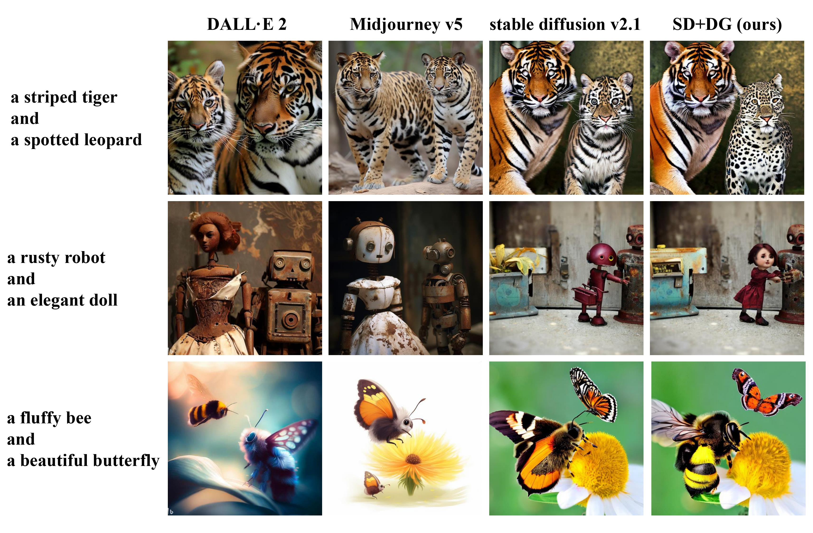

# Detector Guidance for Multi-Object Text-to-Image Generation

[Luping Liu](https://luping-liu.github.io/)1, Zijian Zhang1, [Yi Ren](https://rayeren.github.io/)2, Rongjie Huang1, Xiang Yin2, Zhou Zhao1

1Zhejiang University, 2ByteDance AI Lab

In this work, we introduce Detector Guidance (DG), which integrates a latent object detection model to separate different objects during the generation process. More precisely, DG first performs latent object detection on cross-attention maps (CAMs) to obtain object information. Based on this information, DG then masks conflicting prompts and enhances related prompts by manipulating the following CAMs. Human evaluations demonstrate that DG provides an 8-22% advantage in preventing the amalgamation of conflicting concepts and ensuring that each object possesses its unique region without any human involvement and additional iterations.

Code will be released soon.

