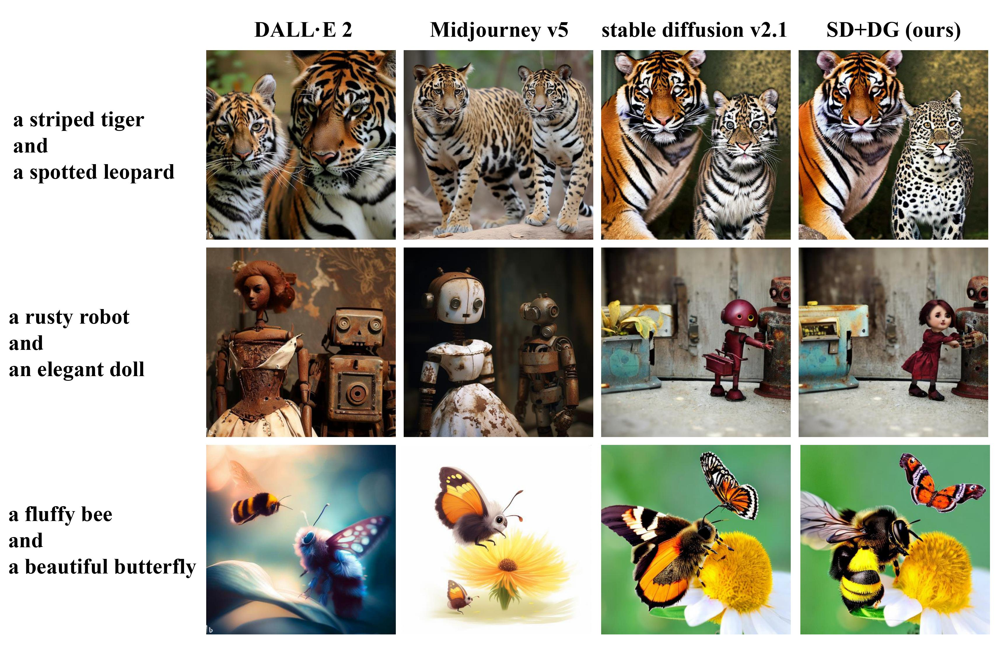

# Detector Guidance for Multi-Object Text-to-Image Generation

This repo is the official PyTorch implementation for [Detector Guidance for Multi-Object Text-to-Image Generation](https://arxiv.org/abs/2306.02236)

by [Luping Liu](https://luping-liu.github.io/)<sup>1</sup>, Zijian Zhang<sup>1</sup>, [Yi Ren](https://rayeren.github.io/)<sup>2</sup>, Rongjie Huang<sup>1</sup>, Zhou Zhao<sup>1</sup>.

<sup>1</sup>Zhejiang University, <sup>2</sup>ByteDance

In this work, we introduce Detector Guidance (DG), which integrates a latent object detection model to separate different objects during the generation process. More precisely, DG first performs latent object detection on cross-attention maps (CAMs) to obtain object information. Based on this information, DG then masks conflicting prompts and enhances related prompts by manipulating the following CAMs. Human evaluations demonstrate that DG provides an 8-22% advantage in preventing the amalgamation of conflicting concepts and ensuring that each object possesses its unique region without any human involvement and additional iterations.

- Compare with the existing large text-to-image models.
    

- Compare with the existing training-free correction methods.

    Our detector guidance offers a superior global understanding. What's more, since DG is utilized in the last 80% timestep and A&E or D&B are mainly applied in the first 20% timestep, they can be seamlessly integrated together.
    

  
## Sampling

Please first prepare the environment and download the checkpoints.

```bash
bash init.sh
```

We offer two versions of sampling code: stable diffusion and diffusers.

- stable diffusion: please use `sample_mto.py`.
```bash
python3 sample_mto.py --sd_type 'sd2.1' --prompt 'a white cat and a brown dog'
```
- Use diffusers: please use `sample.py`.
```bash
python3 sample.py --model 'dg' --prompt 'a white cat and a brown dog' --seed 666
```


## training

We offer our training code in `train_mto.py`.
```bash
bash train_mto.sh
```

## References
If you find this work useful for your research, please consider citing:
```bib
@misc{liu2023detector,
      title={Detector Guidance for Multi-Object Text-to-Image Generation}, 
      author={Luping Liu and Zijian Zhang and Yi Ren and Rongjie Huang and Zhou Zhao},
      year={2023},
      eprint={2306.02236},
      archivePrefix={arXiv},
      primaryClass={cs.CV}
}
```
